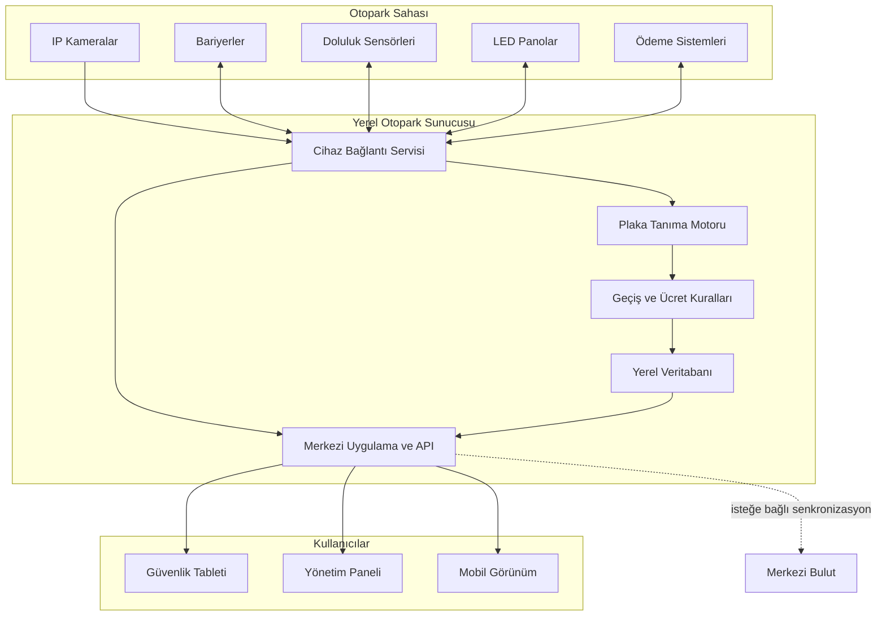
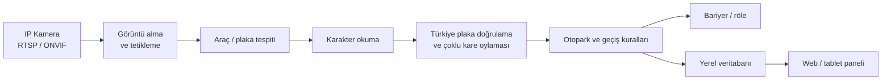

# Provife Plaka Tanıma ve Akıllı Otopark Yönetim Sistemi

Provife; IP kameralardan plaka okuyabilen, bariyerleri ve saha cihazlarını yönetebilen, otoparkın durumunu tek merkezden izleten, internet kesildiğinde yerel olarak çalışmaya devam eden modüler ve web tabanlı bir otopark yönetim platformudur.

Bu proje yalnızca bir OCR veya plaka okuma uygulaması değildir. Hedef; küçük bir apartman ya da işletme otoparkından, birden fazla giriş ve çıkışı bulunan ticari tesislere kadar büyüyebilen yerel öncelikli bir **akıllı otopark işletim platformu** geliştirmektir.

> Proje çalışma adı: **Provife Plaka Tanıma Sistemi**

## İçindekiler

- [Ürün vizyonu](#ürün-vizyonu)
- [Temel ilkeler](#temel-ilkeler)
- [Sistem mimarisi](#sistem-mimarisi)
- [Çalışma biçimleri](#çalışma-biçimleri)
- [Ana yazılım modülleri](#ana-yazılım-modülleri)
- [Donanım ve protokol entegrasyonları](#donanım-ve-protokol-entegrasyonları)
- [Web yönetim paneli](#web-yönetim-paneli)
- [Türkiye plakalarına özel yaklaşım](#türkiye-plakalarına-özel-yaklaşım)
- [Açık kaynak teknoloji adayları](#açık-kaynak-teknoloji-adayları)
- [ParkSetup incelemesinden alınan fikirler](#parksetup-incelemesinden-alınan-fikirler)
- [MVP kapsamı](#mvp-kapsamı)
- [Ürün yol haritası](#ürün-yol-haritası)
- [Başarı ve kabul ölçütleri](#başarı-ve-kabul-ölçütleri)
- [Güvenlik ve kişisel veriler](#güvenlik-ve-kişisel-veriler)
- [Yayın ve test yaklaşımı](#yayın-ve-test-yaklaşımı)
- [Açık kararlar](#açık-kararlar)

## Ürün vizyonu

Sistem aşağıdaki sorulara tek bir merkezden cevap vermelidir:

- Hangi araç giriş veya çıkış yaptı?
- Okunan plaka ne kadar güvenilir?
- Araç abone, ziyaretçi, yetkili veya kara listede mi?
- Bariyer otomatik açılmalı mı, operatör onayı mı gerekli?
- Otoparkta kaç araç ve kaç boş yer var?
- Hangi kamera, bariyer veya sensör çevrimdışı?
- Araç ne kadar süre kaldı ve uygulanacak tarife nedir?
- Birden fazla otopark tek panelden nasıl izlenebilir?
- İnternet kesildiğinde operasyon nasıl devam eder?

Hedef ürün; plaka tanıma, geçiş kontrolü, kapasite yönetimi, abonelik, ücretlendirme, cihaz izleme, raporlama ve ileride park yeri yönlendirme özelliklerini aynı modüler yapı içinde birleştirecektir.

## Temel ilkeler

1. **Yerel öncelikli çalışma:** Kritik geçiş ve bariyer kararları uzak bir buluta bağlı olmayacaktır.
2. **İnternetsiz devamlılık:** İnternet kesildiğinde plaka tanıma, yetki kontrolü ve bariyer operasyonu yerelde sürecektir.
3. **Web tabanlı kullanım:** Tablet, telefon ve bilgisayarlar ortak bir web arayüzü kullanacaktır.
4. **Marka bağımsızlığı:** Kamera, bariyer ve sensörler standart bağlantı katmanları üzerinden sisteme eklenecektir.
5. **Modüler yapı:** OCR motoru, cihaz sürücüleri, otopark kuralları ve kullanıcı arayüzü birbirinden ayrılacaktır.
6. **Ölçeklenebilirlik:** Aynı çekirdek tek kameralı küçük bir sahada ve çok girişli büyük bir tesiste çalışabilecektir.
7. **Güvenli karar:** Düşük güvenli bir OCR sonucu bariyeri kontrolsüz biçimde açmayacaktır.
8. **İzlenebilirlik:** Otomatik ve manuel bütün kritik işlemler zaman ve kullanıcı bilgisiyle kaydedilecektir.
9. **Değiştirilebilir yapay zekâ:** Plaka tespit ve OCR modelleri sistemin tamamı yeniden yazılmadan değiştirilebilecektir.
10. **Saha gerçeklerine uygunluk:** Kamera yerleşimi, gece aydınlatması, ağ kesintisi, elektrik kesintisi ve manuel kullanım senaryoları ürünün parçası olacaktır.

## Sistem mimarisi



### Görüntü işleme akışı



Tek bir kareye dayanarak karar verilmemelidir. Araç birkaç kare boyunca takip edilmeli; uygun sayıdaki okumalar güven puanlarıyla birleştirilmeli ve geçiş başına tek bir sonuç üretilmelidir. Bu yöntem `0/O`, `1/I`, `5/S` ve `8/B` gibi karakter karışıklıklarını azaltır.

## Çalışma biçimleri

### Ekonomik kurulum

IP kamera doğrudan yeterli donanıma sahip Android tablete bağlanır. Tablet plaka tanıma, yerel kayıt, web ekranı ve sınırlı cihaz kontrolünü üstlenebilir.

Uygun olduğu durumlar:

- Bir veya iki kamera
- Kontrollü ve düşük hızlı giriş
- Düşük geçiş yoğunluğu
- Basit bariyer ve yetki senaryosu
- Maliyet odaklı pilot kurulum

### Profesyonel kurulum

IP kameralar ve saha cihazları yerel bir mini bilgisayara bağlanır. Plaka tanıma ve kritik otomasyon burada çalışır; tablet yalnızca güvenlik ve yönetim ekranı olur.

Avantajları:

- 7/24 daha güvenilir çalışma
- Isınma ve Android arka plan kısıtlarından bağımsızlık
- Daha fazla kamera desteği
- Kablolu ağ ve saha protokollerine kolay erişim
- Disk, yedekleme ve servis yönetiminde daha güçlü kontrol
- Tablet değişse bile operasyonun devam etmesi

Küçük kurulumlarda Intel N100/N150 sınıfı bir mini bilgisayar başlangıç için değerlendirilebilir. Kesin donanım seçimi gerçek kamera kayıtları üzerinde yapılacak performans testinden sonra verilmelidir.

## Ana yazılım modülleri

### 1. Plaka tanıma

- RTSP kamera akışı alma
- Araç veya hareket tetikleme
- İlgi alanı tanımlama
- Plaka tespiti
- Perspektif düzeltme ve görüntü iyileştirme
- Plakaya özel OCR
- Çoklu kare takibi ve oylama
- Türkiye plaka formatı doğrulaması
- Güven puanı
- Kanıt görüntüsü
- Tekrarlanan okumaları birleştirme
- Model ve sürüm takibi

### 2. Geçiş kontrolü

- Beyaz liste ve kara liste
- Abone, personel, ziyaretçi ve hizmet aracı türleri
- Gün ve saat bazlı izinler
- Ziyaretçi ön kaydı
- Otomatik veya operatör onaylı bariyer açma
- İçeride/dışarıda araç durumu
- Geri geçiş önleme
- Düşük güvenli okumalar için operatör kuyruğu
- Manuel açma nedeni ve kullanıcı kaydı
- Arıza ve acil durum senaryoları

### 3. Otopark yönetimi

- Tesis, blok, kat, bölge ve park alanı tanımları
- Giriş ve çıkış noktaları
- Anlık kapasite
- Giriş-çıkış eşleştirmesi
- Park süresi
- Ücretsiz süre
- Kayıp kayıt veya okunamayan plaka senaryosu
- Birden fazla giriş ve çıkış
- Birden fazla tesis desteğine hazır veri modeli

Önerilen mekânsal hiyerarşi:

```text
Tesis
└── Otopark
    ├── Blok / Kat
    │   ├── Bölge
    │   │   └── Park alanı
    │   └── Giriş / çıkış noktası
    └── Cihazlar
        ├── Kamera
        ├── Bariyer
        ├── Sensör
        └── LED pano
```

### 4. Abonelik

- Kişi ve şirket aboneleri
- Abone başına birden fazla plaka
- Başlangıç ve bitiş tarihleri
- Kullanım günleri ve saatleri
- Abonelik paketleri
- Ödeme ve borç durumu
- Otomatik geçiş yetkisi
- Askıya alma ve iptal

### 5. Ücretlendirme

- Saatlik ve kademeli tarifeler
- İlk belirli süre ücretsiz kullanım
- Günlük üst sınır
- Gece ve hafta sonu tarifeleri
- İşletme veya mağaza indirimi
- Araç türüne göre fiyatlandırma
- Nakit, kart ve çevrimiçi ödeme entegrasyonlarına hazırlık

Mali cihazlar, ödeme altyapıları ve belge üretimi ilgili mevzuat ve sertifikasyon ihtiyaçları doğrulandıktan sonra devreye alınacaktır. İlk MVP kapsamına dahil değildir.

### 6. Cihaz yönetimi

- Kamera çevrimiçi/çevrimdışı durumu
- Akış kalitesi ve son kare zamanı
- Bariyer ve röle durumu
- Sensör bağlantısı ve son veri zamanı
- LED pano bağlantısı
- Yerel sunucu disk, bellek ve işlemci durumu
- Yazılım ve model sürümü
- Cihaz yapılandırması
- Arıza uyarıları
- Olay ve bakım geçmişi

### 7. Raporlama

- Saatlik, günlük ve aylık giriş sayıları
- Giriş ve çıkış yoğunlukları
- Ortalama park süresi
- Anlık ve tarihsel doluluk
- Abone kullanım raporları
- Tahsilat ve tarife raporları
- Manuel bariyer açmaları
- Başarısız veya düşük güvenli okumalar
- Kamera ve cihaz kesintileri
- Plaka düzeltme geçmişi
- CSV/Excel/PDF dışa aktarımına hazırlık

## Donanım ve protokol entegrasyonları

Sistem belirli bir cihaz markasına bağımlı olmamalıdır. Platformun kullandığı standart işlemler ile üreticinin protokolü arasında cihaz adaptörleri bulunmalıdır.

Örnek standart işlemler:

- Bariyeri aç veya kapat
- Bariyer durumunu oku
- Kamera akışını başlat veya durdur
- Kamera bağlantı sağlığını kontrol et
- Sensör durumunu oku
- LED panoya kapasite ve yön bilgisi gönder
- Ödeme sonucu al

Planlanan bağlantı seçenekleri:

- RTSP ve ONVIF IP kameralar
- HTTP veya TCP kontrollü röleler
- Modbus TCP ve Modbus RTU
- RS485
- MQTT
- Wiegand kart okuyucular
- QR ve barkod okuyucular
- Turnike ve kapı kontrol üniteleri
- Ultrasonik veya manyetik park sensörleri
- LED yönlendirme panoları

İlk sürüm bütün protokolleri desteklemeyecektir. MVP için bir kamera standardı ve bir güvenilir röle/bariyer kontrol yöntemi seçilecektir.

## Web yönetim paneli

Tek web uygulaması, kullanıcının rolüne göre farklı çalışma ekranları sunacaktır.

### Güvenlik görevlisi

- Canlı giriş ve çıkış akışı
- Son okunan plaka
- Kanıt görüntüsü ve güven puanı
- Yetki durumu
- Bariyer durumu
- Manuel bariyer açma
- Düşük güvenli okumayı düzeltme veya onaylama

### Otopark yöneticisi

- Kapasite ve doluluk
- Araçlar, aboneler ve ziyaretçiler
- Tarifeler ve tahsilatlar
- Raporlar
- Kullanıcılar ve yetkiler
- Tesis, kat ve bölge yönetimi

### Teknik servis

- Kamera ve akış durumu
- Bariyer, röle, sensör ve pano durumu
- Son bağlantı zamanı
- Sistem kaynakları
- Hata ve bakım kayıtları
- Yazılım ve model sürümleri

### Merkez yönetimi

- Birden fazla otopark
- Tesisler arası karşılaştırma
- Merkezi kullanıcı ve politika yönetimi
- Toplu raporlama

### Araç sahibi veya ziyaretçi

İleriki aşamada ayrı yetkilendirilmiş mobil web görünümü sunulabilir:

- Ziyaretçi kaydı
- Rezervasyon
- Doluluk bilgisi
- Abonelik durumu
- Ödeme bağlantısı

## Türkiye plakalarına özel yaklaşım

Genel bir OCR modelinin Türk plakalarında gerçek saha başarısı ayrıca ölçülmelidir. Okuma sonucu şu bilgilerle desteklenecektir:

- İl kodunun `01-81` aralığında olması
- Harf ve rakam gruplarının geçerli kombinasyonları
- Boşluk ve tire normalizasyonu
- Türkiye plakalarında kullanılmayan karakterlerin sınırlandırılması
- Çoklu kareler arasında güven ağırlıklı oylama
- Yetkili listesiyle eşleşme sırasında güven eşiği

Format kuralları OCR sonucunu körlemesine değiştirmemelidir. Sistem görmediği bir plakayı üretmemeli; düşük güvenli alternatifleri saklamalı ve gerektiğinde operatör onayı istemelidir.

### Saha veri çeşitliliği

Pilot verisi en az aşağıdaki koşulları içermelidir:

- Gündüz ve gece
- Yağmur ve ıslak zemin yansıması
- Far ve IR parlaması
- Kirli, eğik veya hasarlı plakalar
- Motosiklet plakaları
- Standart dışı veya farklı boyutlu plakalar
- Farklı kamera açıları ve mesafeler
- Hareket bulanıklığı
- Beyaz LED ve kızılötesi aydınlatma

## Açık kaynak teknoloji adayları

Bu liste bir nihai seçim değil, ilk karşılaştırma havuzudur. Kod, model ağırlıkları ve veri setlerinin lisansları ayrı ayrı doğrulanmalıdır.

| İhtiyaç | Aday | İlk değerlendirme |
|---|---|---|
| Plaka tespiti ve OCR prototipi | [FastALPR](https://github.com/ankandrew/fast-alpr) | MIT lisanslı, modüler ve ONNX tabanlı; ilk prototip için güçlü aday |
| Mobil OCR alternatifi | [PaddleOCR](https://github.com/PaddlePaddle/PaddleOCR) | Apache 2.0; küçük mobil modelleri ve Android dağıtım örneği mevcut |
| Mobil/edge model çalıştırma | [ONNX Runtime Mobile](https://onnxruntime.ai/docs/tutorials/mobile/) | Android'de NNAPI ve XNNPACK; farklı donanım hızlandırıcılarına uygun |
| Görüntü işleme | [OpenCV](https://opencv.org/) | Akış, kırpma, perspektif ve görüntü kalite kontrolleri |
| Eski Türk plaka çalışması | [Turkish License Plate Detector](https://github.com/muratlutfigoncu/turkish-license-plate-detector) | Güncel üretim motoru değil; yöntem ve veri incelemesi için kaynak |
| Ticari karşılaştırma | [Plate Recognizer](https://platerecognizer.com/) | Raspberry Pi dahil çeşitli donanımlar için ticari referans; lisans ve maliyet ayrıca değerlendirilir |

### İlk teknik karşılaştırma önerisi

- Plaka tespiti için küçük bir ONNX dedektörü
- Plaka OCR için FastALPR'ın küçük modeli
- Alternatif OCR olarak PaddleOCR mobile/tiny
- Çalıştırma ortamı olarak ONNX Runtime
- Türkiye saha verisi üzerinde ortak test seti
- Gerektiğinde Türkiye'ye özel ince ayar veya model eğitimi

Eski OpenALPR tabanlı projeler, güncellik ve AGPL/ticari lisans ayrımı nedeniyle yeni ürünün doğrudan temeli olarak seçilmemelidir.

## ParkSetup incelemesinden alınan fikirler

[ParkSetup web tabanlı yazılımı](https://www.parksetup.com/product/web-tabanli-yazilim/) plaka tanıma ürününden çok ultrasonik sensörlü otopark doluluk ve yönlendirme platformudur. Ana amacı hangi park alanının boş olduğunu belirlemek ve sürücüyü yönlendirmektir.

Provife'ın ana amacı ise hangi aracın giriş/çıkış yaptığını, yetkili olup olmadığını ve bariyer kararını belirlemektir. İki sistem birbirinin alternatifi değil, tamamlayıcısıdır.

ParkSetup yaklaşımından projeye alınabilecek fikirler:

- Web tabanlı merkezi izleme
- Mobil ve masaüstü uyumlu ekranlar
- Canlı otopark haritası
- Kat, bölge ve park alanı hiyerarşisi
- Yönetim, operasyon ve teknik bakım ekranlarının ayrılması
- Sensör, alan kontrol ünitesi, pano ve yazılımın katmanlı yapısı
- Gerçek zamanlı doluluk ve tarihsel raporlama
- Büyük sahalara ölçeklenebilen cihaz modeli

Provife'ın farklılaşacağı çekirdek alanlar:

- Plaka tanıma
- Abone ve yetkili araç yönetimi
- Giriş-çıkış eşleştirmesi
- Bariyer otomasyonu
- Ziyaretçi ön kaydı
- Kara liste
- Kanıt görüntüsü ve OCR güven puanı
- Çoklu kare doğrulaması
- Marka bağımsız RTSP/ONVIF kamera yönetimi
- Süre, tarife ve ileride ödeme entegrasyonu

### Ürün paketleme fikri

#### Temel paket — Plaka ve bariyer

- Giriş ve çıkış kamerası
- Plaka tanıma
- Yetkili/abone/kara liste
- Bariyer kontrolü
- Geçiş kayıtları
- Yerel çalışma ve web paneli

#### Otopark yönetimi paketi

- Süre ve ücret hesabı
- Tarifeler
- Ziyaretçi araçlar
- Kapasite takibi
- Çoklu giriş/çıkış
- Kullanıcı yetkileri ve raporlama

#### Akıllı yönlendirme paketi

- Kat ve bölge doluluğu
- Park alanı sensörleri
- LED yönlendirme panoları
- Canlı otopark haritası
- Mobil doluluk bilgisi
- Rezervasyon ve özel alan yönetimi

## MVP kapsamı

İlk sürüm küçük fakat gerçek bir sahada kullanılabilir olmalıdır.

### Dahil

- Tek tesis
- Bir giriş ve bir çıkış
- İki RTSP IP kamera
- Yerel plaka tanıma
- Türkiye plaka formatı doğrulaması
- Çoklu kare oylaması
- Abone, yetkili ve kara liste
- Bir bariyer/röle entegrasyonu
- Canlı geçiş ekranı
- Giriş ve çıkış kayıtları
- Kanıt görüntüleri
- Manuel bariyer açma
- Kamera ve cihaz sağlık takibi
- Temel kullanıcı rolleri
- Temel kapasite ve raporlama
- İnternetsiz yerel çalışma
- Tablet uyumlu web arayüzü

### İlk MVP dışında

- Her park yerine ayrı sensör
- LED yönlendirme panoları
- Gelişmiş ücretlendirme
- Mali cihaz ve banka entegrasyonları
- Mobil mağaza uygulaması
- Çok tesisli bulut yönetimi
- Rezervasyon

Bu özellikler temel mimariyi değiştirmeden sonraki aşamalarda eklenecektir.

## Ürün yol haritası

| Aşama | Hedef |
|---|---|
| 0 | Ürün gereksinimleri, saha senaryoları, kamera kayıtları ve teknoloji karşılaştırması |
| 1 | Plaka tanıma, bariyer, geçiş kayıtları ve tablet uyumlu web paneli |
| 2 | Çoklu giriş/çıkış, ziyaretçi yönetimi ve gelişmiş abonelik |
| 3 | Süre hesabı, tarifeler ve ödeme entegrasyonları |
| 4 | Kat/bölge haritası ve gelişmiş kapasite yönetimi |
| 5 | Park sensörleri ve LED yönlendirme panoları |
| 6 | Birden fazla tesis ve merkezi bulut yönetimi |
| 7 | Rezervasyon, kullanıcı mobil hizmetleri ve harici API ekosistemi |

### Önerilen ilk çalışma sırası

1. Hedef saha ve kullanım senaryolarını kesinleştirme
2. Gündüz/gece gerçek kamera örnekleri toplama
3. FastALPR, PaddleOCR ve küçük ONNX modellerini aynı veri üzerinde karşılaştırma
4. Android tablet ve mini bilgisayar üzerinde hız/ısınma testi
5. Kamera ve bariyer için ilk desteklenen donanımı seçme
6. MVP veri modeli ve kullanıcı ekranlarını tasarlama
7. Yerel pilot kurulum
8. Hata analizi ve Türkiye verisiyle iyileştirme
9. Kontrollü saha kabul testi
10. Web test ortamına ve ardından üretime geçiş

## Başarı ve kabul ölçütleri

Başarı tek kare doğruluğuyla değil, **araç geçişi başına doğru sonuç** üzerinden ölçülmelidir.

İlk pilot hedefleri:

- Okunabilir geçişlerde en az `%98` doğru tam plaka hedefi
- Yanlış yetkilendirme ve yanlış bariyer açma oranı için çok daha sıkı eşik
- Uygun saha koşullarında yaklaşık 1 saniye içinde karar
- Gece ve gündüz sonuçlarının ayrı raporlanması
- Kamera veya ağ kesintisinden otomatik toparlanma
- Aynı aracın tekrarlı kayıtlarının bir olayda birleştirilmesi
- Düşük güvenli sonuçların operatöre aktarılması

Bu değerler laboratuvar görüntülerinde değil, gerçek giriş noktasındaki kontrollü pilotta doğrulanacaktır.

## Kamera ve saha gereksinimleri

Yüksek çözünürlük tek başına yeterli değildir. Kamera seçimi ve yerleşiminde aşağıdakiler önemlidir:

- RTSP ve tercihen ONVIF
- PoE ve kablolu ağ
- Uygun lens/dar açı veya ayarlanabilir zoom
- WDR
- Gece IR aydınlatması
- Kısa pozlama/enstantane ayarı
- Sabit bitrate
- Plakanın görüntüde yeterli piksel genişliğine sahip olması
- Kontrollü araç hızı
- Kameranın bariyer ve far parlamasına uygun açıyla yerleştirilmesi

Mümkünse düşük çözünürlüklü alt akış tetikleme için, yüksek çözünürlüklü ana akış ise kanıt ve OCR karesi için kullanılmalıdır.

## Güvenlik ve kişisel veriler

Plaka, zaman ve kanıt görüntüleri kişisel veri ve güvenlik açısından dikkatli ele alınmalıdır. Nihai saklama ve kullanım politikaları hukuki danışmanlıkla doğrulanacaktır.

Teknik tasarımda en az şunlar bulunmalıdır:

- Rol tabanlı erişim
- Güçlü kimlik doğrulama
- Kritik işlemler için denetim kaydı
- Verilerin aktarım sırasında şifrelenmesi
- Yerel veritabanı ve yedeklerin korunması
- Ayarlanabilir görüntü ve olay saklama süreleri
- Yetkisiz dış erişimin engellenmesi
- Kullanıcı düzeltmelerinin eski/yeni değerle kaydedilmesi
- Güvenli yedekleme ve geri yükleme
- Bulut senkronizasyonunun isteğe bağlı ve kontrollü olması

Bariyer kontrolü de yalnızca uygulama seviyesinde korunmamalıdır. Ağ kopması, elektrik kesintisi, yangın/acil geçiş ve manuel müdahale senaryoları saha otomasyonu ile birlikte tasarlanmalıdır.

## Yayın ve test yaklaşımı

### Yerel geliştirme

Projenin yerel çalışma klasörü:

```text
D:\Development\Projects\provife_plate_ocr
```

Bu depo; uygulama kodunu, teknik dokümantasyonu, yerel çalışma yapılandırmalarını ve ileride dağıtım tanımlarını barındıracaktır. Gerçek kamera parolaları, sunucu anahtarları ve kişisel veriler kaynak kod deposuna eklenmeyecektir.

### Web test ortamı

Planlanan test adresi `erisim.com.tr` altında ayrı bir otopark alt alan adıdır. Nihai ad henüz kesinleştirilmemiştir. Örnek adaylar:

- `otopark.erisim.com.tr`
- `park.erisim.com.tr`
- `plaka.erisim.com.tr`

Önerilen varsayılan adres:

```text
otopark.erisim.com.tr
```

Test ortamına geçmeden önce:

1. DNS ve hosting yönetim yöntemi belirlenir.
2. Alt alan adı yerel test sunucusuna veya seçilen test sunucusuna yönlendirilir.
3. HTTPS sertifikası etkinleştirilir.
4. Test ve üretim veritabanları ayrılır.
5. Kamera ve bariyer gibi yerel cihazlara internetten doğrudan erişim verilmez.
6. Uzak web paneli gerekiyorsa yerel sunucuyla güvenli API/VPN kanalı kurulur.
7. Test ortamına gerçek kişisel veri taşınmaz veya veri maskeleme uygulanır.

Subdomain ve sunucu değişiklikleri, DNS/hosting sağlayıcısı ve erişim yöntemi doğrulandıktan sonra ayrıca uygulanacaktır.

## Açık kararlar

Aşağıdaki kararlar geliştirmeye başlamadan veya ilk sprint sırasında kesinleştirilmelidir:

- İlk pilot tesis ve giriş/çıkış sayısı
- Android tabletin hedef modeli ve işletim sistemi
- Yerel mini bilgisayar kullanılıp kullanılmayacağı
- İlk desteklenecek IP kamera modeli
- İlk desteklenecek bariyer/röle kontrol cihazı
- Test subdomain adı
- Hosting ve DNS sağlayıcısı
- Yerel uygulama ile uzak panel arasındaki bağlantı modeli
- Backend, web arayüzü ve veritabanı teknoloji seçimi
- İlk OCR/dedektör modelleri
- Kanıt görüntüsü ve kayıt saklama süreleri
- İlk MVP'de ücretlendirme bulunup bulunmayacağı
- Tek tesis mi, çok tesis altyapısı mı önceliklendirileceği

## Durum

Proje **MVP geliştirme** aşamasına geçmiştir. İlk sürümde React/TypeScript tabanlı tablet uyumlu web yönetim paneli ve Python/FastAPI tabanlı yerel otopark servisi iskeleti bulunmaktadır.

İlk somut hedef; gerçek IP kamera kayıtlarıyla çalışan, plakayı yerelde okuyan, yetki kontrolü yapan, bariyeri kontrollü biçimde açabilen ve olayları tablet uyumlu bir web panelinde gösteren MVP'dir.

### Web panelini yerelde çalıştırma

```powershell
npm install
npm run dev
```

Üretim derlemesi:

```powershell
npm run build
```

Derlenen statik web dosyaları `dist/` klasörüne oluşturulur.

### Yerel otopark servisini çalıştırma

```powershell
python -m venv .venv
.\.venv\Scripts\Activate.ps1
pip install -r edge\requirements.txt
uvicorn edge.app.main:app --reload
```
